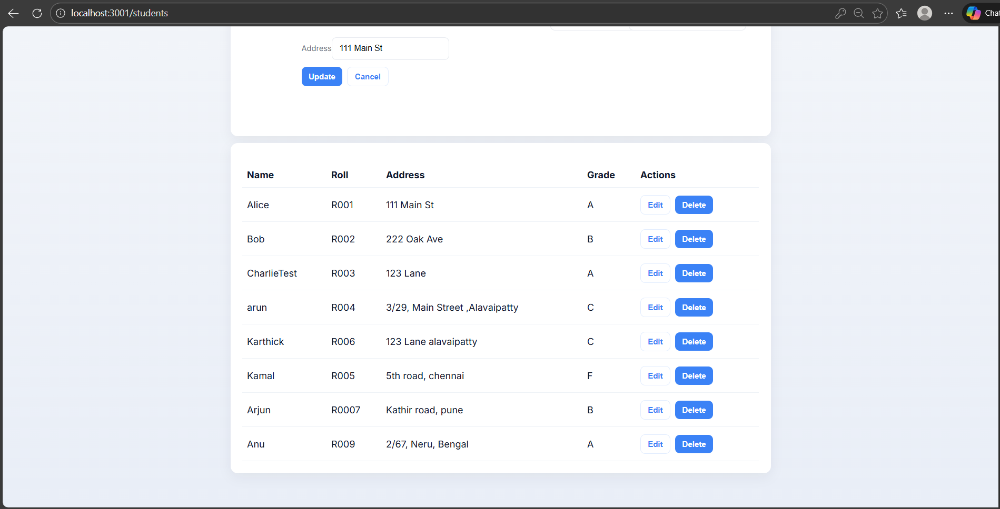
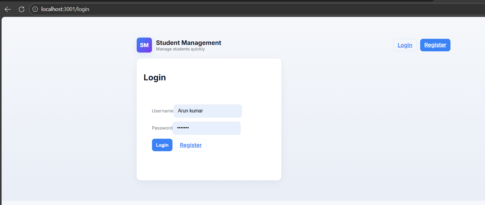
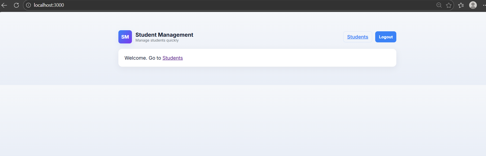
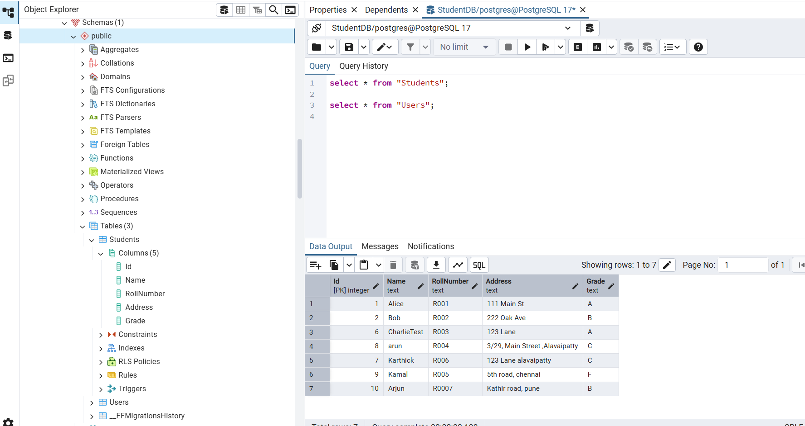

# Student Management System

This repository contains a simple Student Management System with a .NET 10 Web API backend and a React frontend. It includes authentication (JWT), EF Core migrations for PostgreSQL, integration tests, and small CLI tools for DB probing.

**Project Flow**
- **Register**: Client POSTs `username`+`password` to `api/auth/register`. Server hashes password and creates a `User` record.
- **Login**: Client POSTs credentials to `api/auth/login`. Server validates and returns a JWT on success.
- **Students CRUD**: Authenticated client calls `api/students` endpoints to list/create/update/delete student records.

**Quick Start (local)**
- Ensure PostgreSQL is running and accessible.
- Update connection in [StudentManagement.API/appsettings.json](StudentManagement.API/appsettings.json#L1) or use environment variables.

Start backend (terminal A):

```powershell
cd StudentManagement.API
dotnet run --project StudentManagement.API
# server listens on http://localhost:5140
```

Start frontend (terminal B):

```powershell
cd student-management-ui
npm install
npm start
# app available at http://localhost:3000 (dev proxy to backend)
```

## Project Screenshots










**Run tests & migrations**
- Apply EF migrations to PostgreSQL:

```powershell
cd StudentManagement.API
dotnet ef database update
```

- Run integration tests:

```powershell
dotnet test StudentManagement.IntegrationTests
```

**Code Structure**
- **StudentManagement.API/**: Backend API
  - **Program.cs**: App startup, DI, auth, DB provider ([Program.cs](StudentManagement.API/Program.cs#L1)).
  - **controllers/**: `AuthController.cs` (register/login) and `StudentsController.cs` (CRUD).
  - **Data/**: `ApplicationDbContext.cs`, `SeedData.cs`.
  - **DTOs/**: `RegisterDto.cs`, `LoginDto.cs` for incoming models.
  - **Models/**: `User.cs`, `Student.cs`.

- **student-management-ui/**: React frontend
  - **src/api.js**: Axios client with auth interceptor.
  - **src/pages/**: `Login.js`, `Register.js`, `Students.js`.
  - **src/App.js**: Router and nav.
  - **src/index.css**: Global styles and layout.

- **Tools/**: small console utilities
  - **DbCrud/** and **DbProbe/**: CLI tools to run DB-level CRUD operations.

**Security & Configuration Notes**
- JWT settings live in [StudentManagement.API/appsettings.json](StudentManagement.API/appsettings.json#L1). For production, use environment variables or `dotnet user-secrets` to keep keys and DB credentials out of source control.
- Passwords are hashed server-side using `BCrypt.Net-Next`.

Using `dotnet user-secrets` for local development
- Initialize user-secrets for the API project (runs once):

```powershell
cd StudentManagement.API
dotnet user-secrets init
```

- Set your development secrets (example):

```powershell
dotnet user-secrets set "ConnectionStrings:DefaultConnection" "Host=localhost;Port=5432;Database=StudentDB;Username=postgres;Password=YOUR_DB_PASSWORD"
dotnet user-secrets set "Jwt:Key" "<a-long-random-key-at-least-32-bytes>"
```

- Alternatively set environment variables (use double-underscore for nested keys):

```powershell
$env:ConnectionStrings__DefaultConnection = "Host=...;Password=..."
$env:Jwt__Key = "<your-jwt-key>"
```

The API will throw an informative error on startup if these values are missing or invalid.

**UI Behavior**
- After login the front-end stores the JWT in `localStorage` and navigates to `/students` where a responsive table shows student rows with Edit/Delete and a form to Create/Update.
- Error messages from the API are surfaced to the user (e.g., "You are not registered" for login attempts when the user does not exist).

**Next Steps / Suggestions**
- Add CI to run `dotnet test` and frontend linting for every push.
- Move secrets to environment variables and add deployment scripts.
- Consider adding a UI component library (Tailwind/Material) to speed up styling and accessibility.

